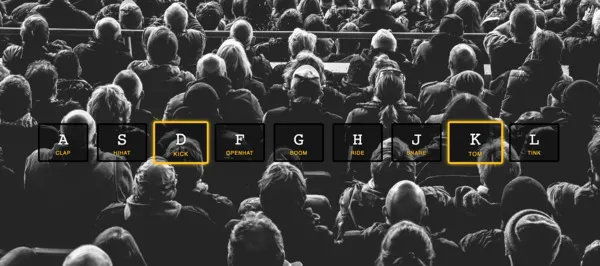

# JavaScript Drum Kit

## Getting Started

Clone or download this repository and open `index.html` in your browser.

You can then press keys A-L to play corresponding drum sounds.

## Features

- 9 drum pads mapped to keyboard keys A-L
- Audio files for each drum sound loaded dynamically
- Visual feedback when keys are pressed
- Responsive design works on any device

## Technologies

- HTML for markup
- CSS for styling
- JavaScript for interactivity and sound playback

## Usage

Press any key from A-L to trigger the associated drum sound. The key will pulse to provide visual feedback. Sounds include clap, hi-hat, kick, open hat and more.

Customize it further by swapping out the audio files or styling. Have fun making beats!

Enjoy jamming on the JS Drum Kit! 🥁
